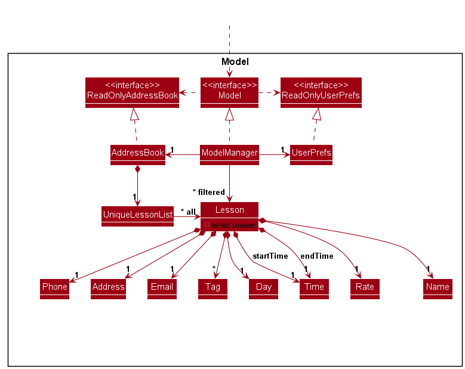
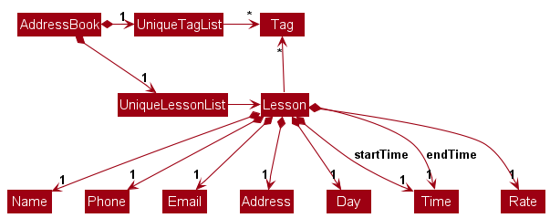

* Table of Contents
{:toc}

--------------------------------------------------------------------------------------------------------------------

## **Acknowledgements**

* {list here sources of all reused/adapted ideas, code, documentation, and third-party libraries -- include links to the original source as well}

--------------------------------------------------------------------------------------------------------------------

## **Setting up, getting started**

Refer to the guide [_Setting up and getting started_](SettingUp.md).

--------------------------------------------------------------------------------------------------------------------

## **Design**

:bulb: **Tip:** The `.puml` files used to create diagrams are in this document `docs/diagrams` folder. Refer to the [_PlantUML Tutorial_ at se-edu/guides](https://se-education.org/guides/tutorials/plantUml.html) to learn how to create and edit diagrams.

### Architecture

The ***Architecture Diagram*** given above explains the high-level design of the App.

Given below is a quick overview of main components and how they interact with each other.

**Main components of the architecture**

**`Main`** (consisting of classes [`Main`](https://github.com/se-edu/addressbook-level3/tree/master/src/main/java/seedu/address/Main.java) and [`MainApp`](https://github.com/se-edu/addressbook-level3/tree/master/src/main/java/seedu/address/MainApp.java)) is in charge of the app launch and shut down.
* At app launch, it initializes the other components in the correct sequence, and connects them up with each other.
* At shut down, it shuts down the other components and invokes cleanup methods where necessary.

The bulk of the app's work is done by the following four components:

* [**`UI`**](#ui-component): The UI of the App.
* [**`Logic`**](#logic-component): The command executor.
* [**`Model`**](#model-component): Holds the data of the App in memory.
* [**`Storage`**](#storage-component): Reads data from, and writes data to, the hard disk.

[**`Commons`**](#common-classes) represents a collection of classes used by multiple other components.

**How the architecture components interact with each other**

The *Sequence Diagram* below shows how the components interact with each other for the scenario where the user issues the command `delete 1`.

Each of the four main components (also shown in the diagram above),

* defines its *API* in an `interface` with the same name as the Component.
* implements its functionality using a concrete `{Component Name}Manager` class (which follows the corresponding API `interface` mentioned in the previous point.

For example, the `Logic` component defines its API in the `Logic.java` interface and implements its functionality using the `LogicManager.java` class which follows the `Logic` interface. Other components interact with a given component through its interface rather than the concrete class (reason: to prevent outside component's being coupled to the implementation of a component), as illustrated in the (partial) class diagram below.

The sections below give more details of each component.

### UI component

The **API** of this component is specified in [`Ui.java`](https://github.com/se-edu/addressbook-level3/tree/master/src/main/java/seedu/address/ui/Ui.java)

The UI consists of a `MainWindow` that is made up of parts e.g.`CommandBox`, `ResultDisplay`, `PersonListPanel`, `StatusBarFooter` etc. All these, including the `MainWindow`, inherit from the abstract `UiPart` class which captures the commonalities between classes that represent parts of the visible GUI.

The `UI` component uses the JavaFx UI framework. The layout of these UI parts are defined in matching `.fxml` files that are in the `src/main/resources/view` folder. For example, the layout of the [`MainWindow`](https://github.com/se-edu/addressbook-level3/tree/master/src/main/java/seedu/address/ui/MainWindow.java) is specified in [`MainWindow.fxml`](https://github.com/se-edu/addressbook-level3/tree/master/src/main/resources/view/MainWindow.fxml)

The `UI` component,

* executes user commands using the `Logic` component.
* listens for changes to `Model` data so that the UI can be updated with the modified data.
* keeps a reference to the `Logic` component, because the `UI` relies on the `Logic` to execute commands.
* depends on some classes in the `Model` component, as it displays `Person` object residing in the `Model`.

### Logic component

**API** : [`Logic.java`](https://github.com/se-edu/addressbook-level3/tree/master/src/main/java/seedu/address/logic/Logic.java)

Here's a (partial) class diagram of the `Logic` component:

The sequence diagram below illustrates the interactions within the `Logic` component, taking `execute("delete 1")` API call as an example.

:information_source: **Note:** The lifeline for `DeleteCommandParser` should end at the destroy marker (X) but due to a limitation of PlantUML, the lifeline continues till the end of diagram.

How the `Logic` component works:

1. When `Logic` is called upon to execute a command, it is passed to an `AddressBookParser` object which in turn creates a parser that matches the command (e.g., `DeleteCommandParser`) and uses it to parse the command.
1. This results in a `Command` object (more precisely, an object of one of its subclasses e.g., `DeleteCommand`) which is executed by the `LogicManager`.
1. The command can communicate with the `Model` when it is executed (e.g. to delete a person). 
   Note that although this is shown as a single step in the diagram above (for simplicity), in the code it can take several interactions (between the command object and the `Model`) to achieve.
1. The result of the command execution is encapsulated as a `CommandResult` object which is returned back from `Logic`.

Here are the other classes in `Logic` (omitted from the class diagram above) that are used for parsing a user command:

How the parsing works:
* When called upon to parse a user command, the `AddressBookParser` class creates an `XYZCommandParser` (`XYZ` is a placeholder for the specific command name e.g., `AddCommandParser`) which uses the other classes shown above to parse the user command and create a `XYZCommand` object (e.g., `AddCommand`) which the `AddressBookParser` returns back as a `Command` object.
* All `XYZCommandParser` classes (e.g., `AddCommandParser`, `DeleteCommandParser`, ...) inherit from the `Parser` interface so that they can be treated similarly where possible e.g, during testing.

#### Subcommand-based parsing

Some commands use an additional parsing layer after the top-level command word is identified. This is useful when multiple related operations share the same command prefix but need different parsing rules and execution logic.

The `tag` command is implemented this way. After `AddressBookParser` identifies the top-level command word `tag`, it delegates the remaining input to `TagCommandParser`. `TagCommandParser` then extracts the subcommand word and forwards the rest of the input to the matching subcommand parser:

* `tag add ...` -> `AddTagCommandParser`
* `tag delete ...` -> `DeleteTagCommandParser`
* `tag find ...` -> `FindTagCommandParser`

This keeps the top-level parser simple while allowing each subcommand to validate a different argument format.

The sequence diagram below shows an example of the subcommand-specific flow for `tag add 1 t/math`, showing the two-stage parsing process to return the resulting `AddTagCommand`.

### Model component
**API** : [`Model.java`](https://github.com/se-edu/addressbook-level3/tree/master/src/main/java/seedu/address/model/Model.java)

The `Model` component,

* stores the address book data i.e., all `Person` objects (which are contained in a `UniquePersonList` object).
* stores the currently 'selected' `Person` objects (e.g., results of a search query) as a separate _filtered_ list which is exposed to outsiders as an unmodifiable `ObservableList<Person>` that can be 'observed' e.g. the UI can be bound to this list so that the UI automatically updates when the data in the list change.
* stores a `UserPref` object that represents the user’s preferences. This is exposed to the outside as a `ReadOnlyUserPref` objects.
* does not depend on any of the other three components (as the `Model` represents data entities of the domain, they should make sense on their own without depending on other components)

:information_source: **Note:** An alternative (arguably, a more OOP) model is given below. It has a `Tag` list in the `AddressBook`, which `Person` references. This allows `AddressBook` to only require one `Tag` object per unique tag, instead of each `Person` needing their own `Tag` objects. 

### Storage component

**API** : [`Storage.java`](https://github.com/se-edu/addressbook-level3/tree/master/src/main/java/seedu/address/storage/Storage.java)

The `Storage` component,
* can save both address book data and user preference data in JSON format, and read them back into corresponding objects.
* inherits from both `AddressBookStorage` and `UserPrefStorage`, which means it can be treated as either one (if only the functionality of only one is needed).
* depends on some classes in the `Model` component (because the `Storage` component's job is to save/retrieve objects that belong to the `Model`)

### Common classes

Classes used by multiple components are in the `seedu.address.commons` package.

--------------------------------------------------------------------------------------------------------------------

## **Implementation**

This section describes some noteworthy details on how certain features are implemented.

### Confirmation for Clear Feature

#### Implementation

The clear confirmation mechanism is designed to prevent accidental data loss. When a user inputs the `clear` command, instead of immediately purging the `Model`, the system transitions to a 'pending confirmation' state.

The following activity diagram summarizes the workflow when a user executes the clear command:

#### Design considerations:

**Aspect: How the confirmation is handled:**

* **Alternative 1 (current choice):** Internal state flag in `LogicManager`.
    * Pros: Simple to implement within the existing command execution flow.
    * Cons: Increases complexity of the `Logic` component state.

* **Alternative 2:** Use a specialized `ConfirmCommand`.
    * Pros: Keeps commands atomic and follows the Command Pattern more strictly.
    * Cons: Requires more boilerplate code to pass the intended action to the confirmation handler.

### \[Proposed\] Undo/redo feature

#### Proposed Implementation

The proposed undo/redo mechanism is facilitated by `VersionedAddressBook`. It extends `AddressBook` with an undo/redo history, stored internally as an `addressBookStateList` and `currentStatePointer`. Additionally, it implements the following operations:

* `VersionedAddressBook#commit()` — Saves the current address book state in its history.
* `VersionedAddressBook#undo()` — Restores the previous address book state from its history.
* `VersionedAddressBook#redo()` — Restores a previously undone address book state from its history.

These operations are exposed in the `Model` interface as `Model#commitAddressBook()`, `Model#undoAddressBook()` and `Model#redoAddressBook()` respectively.

Given below is an example usage scenario and how the undo/redo mechanism behaves at each step.

Step 1. The user launches the application for the first time. The `VersionedAddressBook` will be initialized with the initial address book state, and the `currentStatePointer` pointing to that single address book state.

Step 2. The user executes `delete 5` command to delete the 5th person in the address book. The `delete` command calls `Model#commitAddressBook()`, causing the modified state of the address book after the `delete 5` command executes to be saved in the `addressBookStateList`, and the `currentStatePointer` is shifted to the newly inserted address book state.

Step 3. The user executes `add n/David …​` to add a new person. The `add` command also calls `Model#commitAddressBook()`, causing another modified address book state to be saved into the `addressBookStateList`.

:information_source: **Note:** If a command fails its execution, it will not call `Model#commitAddressBook()`, so the address book state will not be saved into the `addressBookStateList`.

Step 4. The user now decides that adding the person was a mistake, and decides to undo that action by executing the `undo` command. The `undo` command will call `Model#undoAddressBook()`, which will shift the `currentStatePointer` once to the left, pointing it to the previous address book state, and restores the address book to that state.

:information_source: **Note:** If the `currentStatePointer` is at index 0, pointing to the initial AddressBook state, then there are no previous AddressBook states to restore. The `undo` command uses `Model#canUndoAddressBook()` to check if this is the case. If so, it will return an error to the user rather
than attempting to perform the undo.

The following sequence diagram shows how an undo operation goes through the `Logic` component:

:information_source: **Note:** The lifeline for `UndoCommand` should end at the destroy marker (X) but due to a limitation of PlantUML, the lifeline reaches the end of diagram.

Similarly, how an undo operation goes through the `Model` component is shown below:

The `redo` command does the opposite — it calls `Model#redoAddressBook()`, which shifts the `currentStatePointer` once to the right, pointing to the previously undone state, and restores the address book to that state.

:information_source: **Note:** If the `currentStatePointer` is at index `addressBookStateList.size() - 1`, pointing to the latest address book state, then there are no undone AddressBook states to restore. The `redo` command uses `Model#canRedoAddressBook()` to check if this is the case. If so, it will return an error to the user rather than attempting to perform the redo.

Step 5. The user then decides to execute the command `list`. Commands that do not modify the address book, such as `list`, will usually not call `Model#commitAddressBook()`, `Model#undoAddressBook()` or `Model#redoAddressBook()`. Thus, the `addressBookStateList` remains unchanged.

Step 6. The user executes `clear`, which calls `Model#commitAddressBook()`. Since the `currentStatePointer` is not pointing at the end of the `addressBookStateList`, all address book states after the `currentStatePointer` will be purged. Reason: It no longer makes sense to redo the `add n/David …​` command. This is the behavior that most modern desktop applications follow.

The following activity diagram summarizes what happens when a user executes a new command:

#### Design considerations:

**Aspect: How undo & redo executes:**

* **Alternative 1 (current choice):** Saves the entire address book.
  * Pros: Easy to implement.
  * Cons: May have performance issues in terms of memory usage.

* **Alternative 2:** Individual command knows how to undo/redo by
  itself.
  * Pros: Will use less memory (e.g. for `delete`, just save the person being deleted).
  * Cons: We must ensure that the implementation of each individual command are correct.

_{more aspects and alternatives to be added}_

### \[Proposed\] Data archiving

_{Explain here how the data archiving feature will be implemented}_

--------------------------------------------------------------------------------------------------------------------

## **Documentation, logging, testing, configuration, dev-ops**

* [Documentation guide](Documentation.md)
* [Testing guide](Testing.md)
* [Logging guide](Logging.md)
* [Configuration guide](Configuration.md)
* [DevOps guide](DevOps.md)

--------------------------------------------------------------------------------------------------------------------

## **Appendix: Requirements**

### Product scope

**Target user profile**:

* Private Tutors
* Has a need to manage details of multiple students
* Prefer desktop apps over other types
* Can type fast
* Prefers typing to mouse interactions
* Is reasonably comfortable using CLI apps

**Value proposition**: Private tutors have many different things to keep track of. Not many apps out there that can do everything on its own; and so tutors usually need multiple apps. OnlyTutors alleviates this by maintaining various things tutors need: names, addresses, date & time of lessons and payment statuses.

### User stories

Priorities: High (must have) - `* * *`, Medium (nice to have) - `* *`, Low (unlikely to have) - `*`

| Priority | As a …​                  | I want to …​                                                   | So that I can…​                                                 |
|----------|--------------------------|----------------------------------------------------------------|-----------------------------------------------------------------|
| `* * *`  | new tutor                | see usage instructions                                         | refer to instructions when I forget how to use the App          |
| `* * *`  | tutor                    | add a student                                                  | begin managing their details                                    |
| `* * *`  | tutor                    | delete students whom I no longer teach                         | remove clutter and keep my list up-to-date                      |
| `* * *`  | busy tutor               | see all upcoming lessons                                       | plan my days efficiently                                        |
| `* * *`  | travelling tutor         | record lesson's location                                       | know where to go                                                |
| `* * *`  | organized tutor          | see my student's level and subjects                            | prepare and bring the appropriate materials                     |
| `* * *`  | miserly tutor            | record tuition rates and payment status                        | track my income properly                                        |
| `* *`    | careless tutor           | undo my actions                                                | rectify my mistakes                                             |
| `* *`    | humble tutor             | edit my student's information easily                           | correct any wrong or outdated contact info without hassle       |
| `* *`    | tutor with many students | filter students by tags                                        | quickly find a specific group of students                       |
| `* *`    | tutor                    | export and import my data                                      | backup or switch devices                                        |
| `*`      | analytical tutor         | view a summary of my monthly teaching hours and income         | evaluate my profile and workload                                |
| `*`      | busy tutor               | get quick message templates (e.g., “running 10 mins late”)     | message efficiently                                             |
| `*`      | tutor                    | mark whether a student is currently taking lessons or on break | they don't clutter my list but I also don't have to delete them |
| `*`      | disciplined tutor        | record my student's personality                                | know whether to bring my rattan cane                            |
| `*`      | prideful tutor           | record my student's performance                                | measure improvement                                             |

### Use cases

(For all use cases below, the **System** is the `OnlyTutors` and the **Actor** is the `tutor`, unless specified otherwise)

**Use case 01: Add a student**

**Guarantees:**
* A student is added if and only if all required parameters are valid and is not a duplicate.

**MSS**

1. Tutor enters the command to add a student.
2. OnlyTutors saves the changes and shows confirmation.

    Use case ends.

**Extensions**
* 1a. OnlyTutors detects missing or invalid parameter
  * 1a1. OnlyTutors shows an error message.

    Use case ends.

* 1b. OnlyTutors detects a duplicate student (based on name and phone number)
  * 1b1. OnlyTutors rejects the add and gives a warning.

    Use case ends

**Use case 02: Delete a student**

**Guarantees**
* A student is deleted if and only if the `INDEX` parameter is valid and refers to an existing student.

**MSS**
1. Tutor enters the command to delete a student.
2. OnlyTutors deletes the student at the specified index.
3. OnlyTutors shows a confirmation message with the deleted student's information.

    Use case ends.

**Extensions**
* 1a. OnlyTutors detects a missing, invalid or non-integer index
  *  1a1. OnlyTutors shows an error message.

        Use case ends

**Use case 03: List all students**

**Guarantees**
* Displays all students currently stored in the system, including all their details
(name, phone, address, lesson day/time, tuition rate, payment status, tags).
* If no students exist, displays an empty list message.

**MSS**
1. Tutor enters the command to list all students.
2. OnlyTutors retrieves all student contacts from the system.
3. OnlyTutors displays the list of students with all relevant details.

    Use case ends.

**Extensions**
* 1a. OnlyTutors detects an unknown command or typo
    * 1a1. OnlyTutors displays an error message.

        Use case ends.

* 2a. OnlyTutors detects no existing student contacts in the system
    * 2a1. OnlyTutors displays a notification message.

        Use case ends.

**Use case 04: Tag a student**

**Guarantees**
* Tags are added to a student if and only if the `INDEX` parameter is valid, all `TAG` parameters are valid, and none of the specified tags already exist on that student.

**MSS**
1. Tutor enters the command to tag a student.
2. OnlyTutors adds the specified tag(s) to the student at the given index.
3. OnlyTutors shows a confirmation message with the updated student's information.

    Use case ends.

**Extensions**
* 1a. OnlyTutors detects a missing, invalid or non-integer index
  * 1a1. OnlyTutors shows an error message.

    Use case ends.

* 1b. OnlyTutors detects a missing or invalid tag
  * 1b1. OnlyTutors shows an error message.

    Use case ends.

* 2a. OnlyTutors detects that one or more tags already exist on the student
  * 2a1. OnlyTutors shows an error message.
  * 2a2. No tags are added to the student.

    Use case ends.

**Use case 05: Delete tags from a student**

**Guarantees**
* Tags are removed from a student if and only if the `INDEX` parameter is valid and all specified `TAG` parameters exist for that student.

**MSS**
1. Tutor enters the command to delete tags from a student.
2. OnlyTutors removes the specified tag(s) from the student at the given index.
3. OnlyTutors shows a confirmation message with the updated student's information.

    Use case ends.

**Extensions**
* 1a. OnlyTutors detects a missing, invalid or non-integer index
  * 1a1. OnlyTutors shows an error message.

    Use case ends.

* 1b. OnlyTutors detects a missing or invalid tag
  * 1b1. OnlyTutors shows an error message.

    Use case ends.

* 2a. OnlyTutors detects that one or more specified tags do not exist on the student
  * 2a1. OnlyTutors shows an error message.
  * 2a2. No tags are deleted from the student.

    Use case ends.

**Use case 06: Mark a student's payment as paid**

**Guarantees**
* A student's payment status is set to paid if and only if the `INDEX` parameter is valid and the student is not already marked as paid.

**MSS**
1. Tutor enters the command to mark one or more students as paid.
2. OnlyTutors updates the payment status of the specified student(s) to paid.
3. OnlyTutors shows a confirmation message with the marked student(s).

    Use case ends.

**Extensions**
* 1a. OnlyTutors detects a missing, invalid or non-integer index
  * 1a1. OnlyTutors shows an error message.

    Use case ends.

* 2a. OnlyTutors detects that one or more students are already marked as paid
  * 2a1. OnlyTutors shows an error message identifying the already-paid student(s).
  * 2a2. No students are marked.

    Use case ends.

**Use case 07: Unmark a student's payment as unpaid**

**Guarantees**
* A student's payment status is set to unpaid if and only if the `INDEX` parameter is valid and the student is not already marked as unpaid.

**MSS**
1. Tutor enters the command to unmark one or more students as unpaid.
2. OnlyTutors updates the payment status of the specified student(s) to unpaid.
3. OnlyTutors shows a confirmation message with the unmarked student(s).

    Use case ends.

**Extensions**
* 1a. OnlyTutors detects a missing, invalid or non-integer index
  * 1a1. OnlyTutors shows an error message.

    Use case ends.

* 2a. OnlyTutors detects that one or more students are already marked as unpaid
  * 2a1. OnlyTutors shows an error message identifying the already-unpaid student(s).
  * 2a2. No students are unmarked.

    Use case ends.

**Use case 08: Clear all contacts with confirmation**

**Guarantees**
* All contacts are cleared if and only if the tutor confirms the action.

**MSS**
1. Tutor enters the `clear` command.
2. OnlyTutors displays a confirmation prompt: `This will delete all contacts. Are you sure? [y/N]:`.
3. Tutor enters `y`.
4. OnlyTutors deletes all contacts and shows a success message.

    Use case ends.

**Extensions**
* 3a. Tutor enters `n` or any input other than `y`
  * 3a1. OnlyTutors aborts the clear and shows an aborted message.
  * 3a2. No contacts are deleted.

    Use case ends.

### Non-Functional Requirements

| # | Category | Requirement |
|---|----------|-------------|
| 1 | Portability | Should work on any mainstream OS (Windows, Linux, macOS) as long as it has Java 17 or above installed. |
| 2 | Standalone | Should work as a standalone application without requiring an installer. The app should be packaged as a single JAR file. |
| 3 | Performance | Should be able to hold up to 1000 students without a noticeable sluggishness in performance for typical usage. |
| 4 | Response Time | Any command should complete and display results within 3 seconds under normal operating conditions. |
| 5 | CLI Efficiency | A user with above average typing speed for regular English text should be able to accomplish most of the tasks faster using commands than using the mouse. |
| 6 | Usability | A tutor with no prior technical background should be able to use the core features of the app after reading the user guide. |
| 7 | Data Storage | All data should be stored locally in a human-editable text file, not in a database management system. |
| 8 | Single User | The application is designed for a single user and does not need to support multiple concurrent users. |
| 9 | Offline | Should be fully functional without requiring an internet connection. |
| 10 | Display | Should display properly on screens with resolutions of 1920x1080 or higher at 100% and 125% scaling, and usable on screens with resolutions of 1280x720 or higher at 150% scaling. |
| 11 | File Size | The final packaged JAR file should not exceed 100MB. Documentation PDF files should not exceed 15MB each. |
| 12 | PDF-Friendly | The Developer Guide and User Guide should be PDF-friendly (no expandable panels, embedded videos, or animated GIFs). |

### Glossary

* **Mainstream OS**: Windows, Linux, Unix, MacOS
* **Private contact detail**: A contact detail that is not meant to be shared with others
* **Tag**: A label attached to a student to help tutors categorize or filter students, such as `Math`, `Sec4`, or `ExamPrep`

--------------------------------------------------------------------------------------------------------------------

## **Appendix: Instructions for manual testing**

Given below are instructions to test the app manually.

:information_source: **Note:** These instructions only provide a starting point for testers to work on;
testers are expected to do more *exploratory* testing.

### Launch and shutdown

1. Initial launch

   1. Download the jar file and copy into an empty folder

   1. Double-click the jar file Expected: Shows the GUI with a set of sample contacts. The window size may not be optimum.

1. Saving window preferences

   1. Resize the window to an optimum size. Move the window to a different location. Close the window.

   1. Re-launch the app by double-clicking the jar file. 
       Expected: The most recent window size and location is retained.

### Adding a student

1. Adding a student with all required fields

   1. Prerequisites: None.

   1. Test case: `add n/John Doe p/91234567 e/johnd@example.com a/311, Clementi Ave 2, #02-25 d/Monday st/10:00 et/12:00 r/50` 
      Expected: Student is added to the list. Details of the added student shown in the status message.

   1. Test case: `add n/John Doe p/91234567 e/johnd@example.com a/311, Clementi Ave 2, #02-25 d/Monday st/12:00 et/10:00 r/50` 
      Expected: No student is added. Error details about invalid time range shown in the status message.

   1. Other incorrect add commands to try: `add`, `add n/John` (missing required fields) 
      Expected: No student is added. Error details shown in the status message.

### Editing a student

1. Editing a student's new fields (day, start time, end time, rate)

   1. Prerequisites: List all students using the `list` command. At least one student in the list.

   1. Test case: `edit 1 d/Tuesday st/14:00 et/16:00 r/60` 
      Expected: First student's day, time, and rate are updated. Success message shown.

   1. Test case: `edit 1 st/18:00` (when student 1's end time is 16:00) 
      Expected: No change. Error message about invalid time range shown (start time must be before end time).

### Deleting a student

1. Deleting a student while all students are being shown

   1. Prerequisites: List all students using the `list` command. Multiple students in the list.

   1. Test case: `delete 1` 
      Expected: First student is deleted from the list. Details of the deleted student shown in the status message.

   1. Test case: `delete 1 2` 
      Expected: First and second students are deleted. Count and names of deleted students shown in the status message.

   1. Test case: `delete 0` 
      Expected: No student is deleted. Error details shown in the status message. Status bar remains the same.

   1. Other incorrect delete commands to try: `delete`, `delete x` (where x is larger than the list size) 
      Expected: Similar to previous.

### Marking and unmarking payment status

1. Marking a student as paid

   1. Prerequisites: List all students using the `list` command. At least one student in the list with unpaid status.

   1. Test case: `mark 1` 
      Expected: First student is marked as paid. Success message with student name shown in the status message.

   1. Test case: `mark 1 2` (when both students are unpaid) 
      Expected: First and second students are marked as paid. Success message with count and names shown.

   1. Test case: `mark 1` (when student 1 is already paid) 
      Expected: No change. Error message with the student's index and name shown (e.g., `This student has already been marked as paid: (1) John Doe`).

1. Unmarking a student as unpaid

   1. Prerequisites: At least one student in the list with paid status.

   1. Test case: `unmark 1` 
      Expected: First student is marked as unpaid. Success message with student name shown.

   1. Test case: `unmark 1 2` (when both students are paid) 
      Expected: First and second students are marked as unpaid. Success message with count and names shown.

   1. Test case: `unmark 1` (when student 1 is already unpaid) 
      Expected: No change. Error message with the student's index and name shown (e.g., `This student has already been marked as unpaid: (1) John Doe`).

### Clearing all entries

1. Clearing the address book with confirmation

   1. Prerequisites: At least one student in the list.

   1. Test case: `clear`, then `y` 
      Expected: First command shows confirmation prompt `This will delete all contacts. Are you sure? [y/N]:`. After entering `y`, all contacts are removed. Success message shown.

   1. Test case: `clear`, then `n` 
      Expected: First command shows confirmation prompt. After entering `n`, clear is aborted. No contacts are removed.

   1. Test case: `clear`, then any other input (e.g., `hello`) 
      Expected: First command shows confirmation prompt. Non-`y` input is treated as abort. No contacts are removed.

### Managing tags

1. Adding a tag to a student

   1. Prerequisites: List all students using the `list` command. At least one student in the list.

   1. Test case: `tag add 1 t/Math` 
      Expected: Tag `Math` is added to the first student. Success message shows the exact added tag and student.

   1. Test case: `tag add 1 t/Math` (when student already has `math` tag) 
      Expected: No change. Error message shown because the command would be a no-op.

   1. Test case: `tag add 1 2 t/Science`  
      Expected: Tag `Science` is added to both students. Batch success message shows each affected student with the exact added tags.

   1. Test case: `tag add 1 3 t/Friends` (when student 1 already has `friends`, student 3 does not) 
      Expected: Only student 3 is updated. Success message shows `friends` as the exact added tag for student 3.

   1. Test case: `tag add 1 t/Friends t/Science` (when student 1 already has `friends` but not `science`) 
      Expected: `science` is added and `friends` remains. Success message shows only `science` as the added tag.

   1. Test case: `tag add 1 2 t/Science t/Math`  
      Expected: Each student is updated only with the tags they were missing. Batch success message shows the exact added tags per student.

1. Deleting a tag from a student

   1. Prerequisites: At least one student with a tag in the list.

   1. Test case: `tag delete 1 t/Math` (when student 1 has `math` tag) 
      Expected: Tag `math` is removed. Success message shows the exact deleted tag and student.

   1. Test case: `tag delete 1 t/Math` (when student 1 does not have `math` tag) 
      Expected: No change. Error message shown because the command would be a no-op.

   1. Test case: `tag delete 1 3 t/Friends` (when student 1 has `friends`, student 3 does not) 
      Expected: Only student 1 is updated. Success message shown.

   1. Test case: `tag delete 1 t/Friends t/Science` (when student 1 has `friends` but not `science`) 
      Expected: `friends` is deleted and the missing `science` tag is ignored. Success message shown.

1. Finding students by tag

   1. Prerequisites: At least one student with a tag in the list.

   1. Test case: `tag find t/Math` 
      Expected: All students with the exact `math` tag are listed. Count shown in status message.

   1. Test case: `tag find t/ma` 
      Expected: No students listed unless a student has the exact tag `ma`. Partial matches such as `math` are not returned.

   1. Test case: `tag find t/NonExistentTag` 
      Expected: No students listed. Message indicating no students found shown.

   1. Test case: `tag find t/` 
      Expected: Command is rejected with a validation error because tag values cannot be empty.

### Saving data

1. Dealing with missing data file

   1. Delete the `data/onlytutors.json` file if it exists.

   1. Launch the app. 
      Expected: App starts with a set of sample student data.

1. Dealing with corrupted data file

   1. Open `data/onlytutors.json` and introduce invalid content (e.g., delete a required field or add invalid characters).

   1. Launch the app. 
      Expected: App starts with an empty student list. A warning may be logged.

--------------------------------------------------------------------------------------------------------------------

## **Appendix: Effort**

### Overview

OnlyTutors is a brownfield project adapted from AddressBook Level 3 (AB3). The team invested significant effort to transform a generic contact management app into a purpose-built tutor management tool for private tutors.

### Difficulty Level

The project was of **moderate-to-high** difficulty. The team had to:
- Understand and navigate the existing AB3 codebase before making changes
- Maintain backward compatibility with existing AB3 features while adding new ones
- Ensure all new features were well-integrated with the existing architecture (Logic, Model, Storage, UI)

### Features Implemented

The following features were added beyond AB3:

| Feature | Description |
|---------|-------------|
| **New Person Fields** | Added `Day`, `StartTime`, `EndTime`, `Rate`, and `isPaid` fields to the `Person` model, requiring updates to the parser, storage (JSON), UI card, and sample data |
| **Mark / Unmark** | Commands to toggle a student's payment status, with batch support (multiple indices) |
| **Tag Commands** | `tag add`, `tag delete`, and `tag find` subcommands for flexible tag management, using a subcommand-based parsing architecture |
| **Batch Delete** | Extended `delete` to accept multiple indices in a single command |
| **Clear Confirmation** | Added a two-step confirmation flow for the `clear` command to prevent accidental data loss |

### Effort Relative to AB3

Compared to AB3, the team estimates the effort required was approximately **1.5–2x** that of AB3, due to:

- **Model expansion**: Adding 5 new fields to `Person` required coordinated changes across all four components (UI, Logic, Model, Storage). Each field needed validation, serialization, and display logic.
- **Subcommand architecture**: The `tag` command family introduced a new subcommand-based parsing pattern (`tag add`, `tag delete`, `tag find`) not present in AB3, requiring a new `TagCommand` base class and corresponding parsers.
- **Batch operations**: Extending `delete`, `mark`, and `unmark` to handle multiple indices introduced complexity around partial-failure handling and error messaging.
- **Payment status flow**: The `mark`/`unmark` feature required careful handling of state transitions, duplicate index prevention, and informative error feedback.

### Reuse

A significant portion of effort was saved by building on top of AB3:
- AB3's four-component architecture (UI, Logic, Model, Storage) was reused as-is, eliminating the need to design the base structure from scratch.
- AB3's existing command infrastructure (parsers, `Command`, `CommandResult`, `Model` interface) was reused and extended rather than replaced.
- AB3's test utilities (`TypicalPersons`, `PersonBuilder`, `CommandTestUtil`) were reused and extended to support new fields.

This reuse is estimated to have saved roughly 30–40% of total effort, allowing the team to focus on domain-specific features rather than boilerplate.

### Challenges Faced

- **Time validation**: Ensuring `StartTime < EndTime` across both `add` and `edit` flows required cross-field validation that AB3's single-field validation pattern did not accommodate.
- **Tag casing**: Handling case-insensitive tag matching while preserving display casing required careful design decisions.
- **Confirmation flow for Clear**: Implementing a stateful confirmation step required changes to the parser to handle a two-step command sequence.
