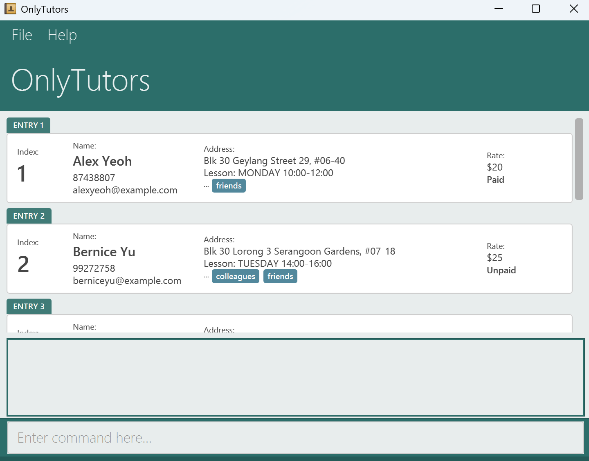

**OnlyTutors** is a desktop app for **private tutors in Singapore** to manage students, lessons, and payments. It is optimised for use via a **Command Line Interface (CLI)** with the benefits of a Graphical User Interface (GUI). If you can type fast, OnlyTutors helps you manage your tutoring business faster than traditional apps.

**Who is this guide for?** Private tutors who are comfortable typing commands and want a fast, no-frills way to keep track of their students.

**What does OnlyTutors assume?** You have basic familiarity with using a computer and typing commands. No programming knowledge is required.

* Table of Contents
{:toc}

--------------------------------------------------------------------------------------------------------------------

## Command Summary

A quick reference of all available commands. Click any command name to jump to its detailed section.

| Action | Format | Example |
|--------|--------|---------|
| [**Add**](#adding-a-student-add) | `add n/NAME p/PHONE e/EMAIL a/ADDRESS d/DAY st/START et/END r/RATE` | `add n/John Doe p/98765432 e/johnd@example.com a/Clementi Ave 2 d/Monday st/15:00 et/17:00 r/50` |
| [**List**](#listing-all-students-list) | `list` | `list` |
| [**Edit**](#editing-a-student-edit) | `edit INDEX [n/NAME] [p/PHONE] [e/EMAIL] [a/ADDRESS] [d/DAY] [st/START] [et/END] [r/RATE] [t/TAG]…​` | `edit 1 p/91234567 d/Friday` |
| [**Find**](#finding-students-by-name-find) | `find KEYWORD [MORE_KEYWORDS]…​` | `find John Alice` |
| [**Tag Find**](#finding-students-by-tag-tag-find) | `tag find TAG [MORE_TAGS]…​` | `tag find math primary3` |
| [**Delete**](#deleting-a-student-delete) | `delete INDEX [INDEX]…​` | `delete 1 3 7` |
| [**Tag Add**](#adding-tags-to-a-student-tag-add) | `tag add INDEX [INDEX]…​ t/TAG [t/TAG]…​` | `tag add 1 2 3 t/math` |
| [**Tag Delete**](#deleting-tags-from-a-student-tag-delete) | `tag delete INDEX [INDEX]…​ t/TAG [t/TAG]…​` | `tag delete 1 2 t/math` |
| [**Mark**](#marking-a-student-as-paid-mark) | `mark INDEX [INDEX]…​` | `mark 1 2 3` |
| [**Unmark**](#marking-a-student-as-unpaid-unmark) | `unmark INDEX [INDEX]…​` | `unmark 1 2 3` |
| [**Clear**](#clearing-all-entries-clear) | `clear` | `clear` |
| [**Help**](#viewing-help-help) | `help` | `help` |
| [**Exit**](#exiting-the-program-exit) | `exit` | `exit` |

--------------------------------------------------------------------------------------------------------------------

## Quick Start

1. Ensure you have Java `17` or above installed on your computer. 
   **Mac users:** Ensure you have the precise JDK version prescribed [here](https://se-education.org/guides/tutorials/javaInstallationMac.html).

1. Download the latest `.jar` file from [here](https://github.com/AY2526S2-CS2103T-T17-3/tp/releases).

1. Copy the file to the folder you want to use as the _home folder_ for OnlyTutors.

1. Open a command terminal, `cd` into the folder, and run: `java -jar addressbook.jar` 
   A GUI similar to the screenshot below should appear in a few seconds. The app contains some sample data to help you get started. 
   

### Understanding the Interface

The screenshot below shows the OnlyTutors interface with sample data. Each student card displays their name, phone, email, address, lesson schedule (day and time), tuition rate, payment status, and tags.

| Area | Location | Purpose |
|------|----------|---------|
| **Menu Bar** | Top | Access `File` (exit) and `Help` (open help window) |
| **Student List** | Centre | Displays your students as cards with all their details. Each card shows a **Paid** or **Unpaid** label next to the rate |
| **Result Display** | Below student list | Shows feedback after each command (success messages or error details) |
| **Command Box** | Near bottom | Type your commands here and press Enter to execute them |
| **Status Bar** | Bottom | Shows the file path where your data is saved |

### Try These Commands

Try entering these commands one at a time to get a feel for OnlyTutors:

| Step | Command | What it does |
|------|---------|-------------|
| 1 | `list` | Lists all students |
| 2 | `add n/John Doe p/98765432 e/johnd@example.com a/311, Clementi Ave 2, #02-25 d/Monday st/15:00 et/17:00 r/50` | Adds a student named John Doe with a Monday lesson |
| 3 | `tag add 1 t/math` | Adds the tag `math` to the 1st student |
| 4 | `mark 1` | Marks the 1st student as paid |
| 5 | `find John` | Searches for students with "John" in their name |
| 6 | `list` | Returns to the full student list |
| 7 | `delete 3` | Deletes the 3rd student shown in the list |

Refer to the [Features](#features) section below for the full details of each command.

--------------------------------------------------------------------------------------------------------------------

## Features

**:information_source: Notes about the command format:** 

* Words in `UPPER_CASE` are parameters to be supplied by you. 
  e.g. in `add n/NAME`, `NAME` is a parameter which can be used as `add n/John Doe`.

* Items in square brackets are optional. 
  e.g. `[n/NAME]` means the `n/NAME` parameter can be omitted.

* Items with `…`​ after them can be used multiple times including zero times. 
  e.g. `[t/TAG]…​` can be used as ` ` (i.e. 0 times), `t/math`, `t/math t/primary3` etc.

* Parameters can be in any order. 
  e.g. if the command specifies `n/NAME p/PHONE`, `p/PHONE n/NAME` is also acceptable.

* Extraneous parameters for commands that do not take in parameters (such as `help`, `list`, `exit` and `clear`) will be ignored. 
  e.g. if the command specifies `help 123`, it will be interpreted as `help`.

* If you are using a PDF version of this document, be careful when copying and pasting commands that span multiple lines as space characters surrounding line-breaks may be omitted when copied over to the application.

### Parameter Summary

| Parameter | Prefix | Constraints                                                                                          | Example |
|-----------|--------|------------------------------------------------------------------------------------------------------|---------|
| **Name** | `n/` | Letters and spaces only; cannot be blank                                                             | `n/John Doe` |
| **Phone** | `p/` | Exactly 8 digits, starting with 6, 8, or 9 (Singapore format)                                        | `p/91234567` |
| **Email** | `e/` | Standard email format (`local@domain`)                                                               | `e/john@example.com` |
| **Address** | `a/` | Any non-blank text                                                                                   | `a/Blk 30, Geylang St 29` |
| **Day** | `d/` | A day of the week (case-insensitive): Monday, Tuesday, Wednesday, Thursday, Friday, Saturday, Sunday | `d/Monday` |
| **Start Time** | `st/` | 24-hour format `HH:mm` (e.g., `09:00`, `14:30`)                                                      | `st/14:00` |
| **End Time** | `et/` | 24-hour format `HH:mm`; **must be strictly after** start time                                        | `et/16:00` |
| **Rate** | `r/` | A non-negative whole number representing dollars per lesson                                          | `r/50` |
| **Tag** | `t/` | Alphanumeric characters only (no spaces); stored in lowercase                                        | `t/math` |

--------------------------------------------------------------------------------------------------------------------

### Adding a student: `add`

Adds a new student to OnlyTutors.

**Format:** `add n/NAME p/PHONE e/EMAIL a/ADDRESS d/DAY st/START_TIME et/END_TIME r/RATE`

* All fields are required.
* Tags cannot be added during the `add` command. Use [`tag add`](#adding-tags-to-a-student-tag-add) after adding the student.
* New students are marked as **Unpaid** by default.

:exclamation: **Warning:**
OnlyTutors does not allow duplicate students. Two students are considered duplicates if they have the **same name** 
(case-insensitive) **and** the **same phone number**.

**:information_source: Rationale for duplicate detection:**

OnlyTutors considers two contacts duplicates if they have the **same name (case-insensitive)** and **same phone number**.

This design is chosen because:

* Names alone are not unique (e.g. many students may share the same name)
* Phone numbers alone are not reliable (e.g. siblings may share a parent’s number)
* Combining both provides a practical and reliable identifier for tutors

**Additionally:**

* Duplicate detection is case-insensitive (e.g. `john doe` = `John Doe`)
* Names are displayed exactly as entered to preserve user formatting

**Examples:**

| Command | What it does |
|---------|-------------|
| `add n/John Doe p/98765432 e/johnd@example.com a/311, Clementi Ave 2, #02-25 d/Monday st/15:00 et/17:00 r/50` | Adds student John Doe with a Monday 3–5pm lesson at $50/lesson |
| `add n/Alice Tan p/81234567 e/alice@example.com a/Blk 30 Geylang St 29, #06-40 d/Wednesday st/10:00 et/12:00 r/60` | Adds student Alice Tan with a Wednesday 10am–12pm lesson at $60/lesson |

**Expected output** (on success):
> `New contact added: John Doe; Phone: 98765432; Email: johnd@example.com; Address: 311, Clementi Ave 2, #02-25; Day: MONDAY; Start Time: 15:00; End Time: 17:00; Rate: 50; Tags:`

**Expected output** (on fail):
> `Names should contain only alphanumeric characters, with words separated by a single space or '/', e.g. 'Tan Ah Kow' or 'Raj S/O Kumar'. Names must not start or end with a space or '/', and must not contain consecutive spaces or '/' characters`

### ⚠️ Common mistakes when adding a student

| Mistake | Why it fails                                   |
|--------|------------------------------------------------|
| `r/$40` | Symbols are not allowed; rate must be a number |
| `r/40.0` | Decimals are not allowed; must be an integer   |
| `n/John123` | Name cannot contain numbers                    |
| `n/` | Name cannot be empty                           |
| `p/12345678` | Must start with 6, 8, or 9                     |
| `d/Mon` | Must use full day name (e.g. Monday)           |
| `st/3pm` | Must use 24-hour format (e.g. 15:00)           |
| `et/14:00 st/15:00` | End time must be after start time              |

:bulb: **Tip:**
Always follow the exact formats shown in the examples to avoid errors.

--------------------------------------------------------------------------------------------------------------------

### Listing all students: `list`

Shows a list of all students in OnlyTutors.

**Format:** `list`

:bulb: **Tip:**
Use `list` after a [`find`](#finding-students-by-name-find) command to return to the full student list.

**Expected output:**
> `Listed all persons`

--------------------------------------------------------------------------------------------------------------------

### Editing a student: `edit`

Edits the details of an existing student in OnlyTutors.

**Format:** `edit INDEX [n/NAME] [p/PHONE] [e/EMAIL] [a/ADDRESS] [d/DAY] [st/START_TIME] [et/END_TIME] [r/RATE] [t/TAG]…​`

* Edits the student at the specified `INDEX` (a positive integer: 1, 2, 3, …).
* At least one of the optional fields must be provided.
* Existing values will be updated to the input values.

**Editing Tags:**
* When editing tags with `t/`, existing tags are **replaced entirely**. 
* Remove all tags by typing `t/` without specifying any tags after it (not true for other fields since they must be nonempty).
* Note the same rules for adding a person apply here, i.e. person name must contain only alphabets, end time must be strictly after start time and so on.

:exclamation: **Warning:**
Editing tags with the `edit` command **replaces all existing tags**. If a student has tags `math` and `primary3`, running `edit 1 t/science` will result in only the `science` tag remaining.

:bulb: **Tip:**
To add tags without replacing, use [`tag add`](#adding-tags-to-a-student-tag-add) instead.

**Examples:**

| Command | What it does |
|---------|-------------|
| `edit 1 p/91234567 e/johndoe@example.com` | Changes the phone and email of the 1st student |
| `edit 2 n/Betsy Crowe t/` | Changes the name of the 2nd student and clears all tags |
| `edit 3 d/Friday st/14:00 et/16:00` | Changes the lesson day and time for the 3rd student |

**Expected output** (on success):
> `Edited Person: Elliot; Phone: ...`

--------------------------------------------------------------------------------------------------------------------

### Finding students by name: `find`

Finds students whose names contain any of the given keywords.

**Format:** `find KEYWORD [MORE_KEYWORDS]…​`

* The search is **case-insensitive**. e.g. `hans` will match `Hans`.
* The order of keywords does not matter. e.g. `Hans Bo` will match `Bo Hans`.
* Only the **name** is searched.
* Only **full words** are matched. e.g. `Han` will **not** match `Hans`.
* Students matching **at least one** keyword will be returned (i.e. `OR` search).

**Examples:**

| Command | What it does |
|---------|-------------|
| `find John` | Returns `john` and `John Doe` |
| `find alex david` | Returns `Alex Yeoh` and `David Li` |

**Expected output:**
> `2 persons listed!`

:bulb: **Tip:**
After using `find`, use [`list`](#listing-all-students-list) to return to the full student list.

--------------------------------------------------------------------------------------------------------------------

### Finding students by tag: `tag find`

Finds students who match all of the given tags.

**Format:** `tag find t/TAG [t/TAGS]…​`

* The search is **case-insensitive**. e.g. `Math` will match `math`.
* Only students matching **all** tags will be returned (i.e. `AND` search).
* Tags are alphanumeric only (no spaces).

**Examples:**

| Command | What it does |
|---------|-------------|
| `tag find t/math` | Returns students tagged with `math` |
| `tag find primary3 science` | Returns students tagged with both `primary3` and `science` |

**Expected output:**
> `2 persons listed!`

:bulb: **Tip:**
After using `tag find`, use [`list`](#listing-all-students-list) to return to the full student list.

--------------------------------------------------------------------------------------------------------------------

### Deleting a student: `delete`

Deletes the specified student from OnlyTutors.

**Format:** `delete INDEX [INDEX]…​`

* Deletes the student(s) at the specified `INDEX`(es).
* The index refers to the index number shown in the displayed student list.
* The index **must be a positive integer** (1, 2, 3, …).

:bulb: **Tip:**
You can delete multiple students at once by specifying multiple indices. e.g. `delete 1 3 7` deletes the 1st, 3rd, and 7th students.

:exclamation: **Warning:**
This action cannot be undone. Make sure you have selected the correct student(s) before deleting.

**Examples:**

| Command | What it does |
|---------|-------------|
| `list` then `delete 2` | Deletes the 2nd student in the full list |
| `delete 1 3 7` | Deletes the 1st, 3rd, and 7th students |
| `find Betsy` then `delete 1` | Deletes the 1st student in the `find` results |

**Expected output** (on success):
> `Deleted Person: Betsy Crowe; Phone: ...`

--------------------------------------------------------------------------------------------------------------------

### Adding tags to a student: `tag add`

Adds one or more tags to a student **without replacing** existing tags.

**Format:** `tag add INDEX [INDEX]…​ t/TAG [t/TAG]…​`

* Adds the specified tag(s) to the student(s) at the specified `INDEX`(es).
* The index **must be a positive integer** (1, 2, 3, …).
* At least one tag must be provided.
* Tags are alphanumeric only (no spaces) and are stored in lowercase.
* If any of the specified tags already exist on a student, the command will fail.

:bulb: **Tip:**
You can tag multiple students at once by specifying multiple indices. e.g. `tag add 1 2 3 t/math` adds the `math` tag to the 1st, 2nd, and 3rd students.

**Examples:**

| Command | What it does |
|---------|-------------|
| `tag add 1 t/math` | Adds the tag `math` to the 1st student |
| `tag add 2 t/primary3 t/science` | Adds tags `primary3` and `science` to the 2nd student |
| `tag add 1 2 3 t/math` | Adds the tag `math` to the 1st, 2nd, and 3rd students |

**Expected output** (on success):
> `Tag(s) added to person: John Doe; Phone: ...`

--------------------------------------------------------------------------------------------------------------------

### Deleting tags from a student: `tag delete`

Removes one or more tags from a student.

**Format:** `tag delete INDEX [INDEX]…​ t/TAG [t/TAG]…​`

* Removes the specified tag(s) from the student(s) at the specified `INDEX`(es).
* The index **must be a positive integer** (1, 2, 3, …).
* At least one tag must be provided.
* If any of the specified tags do not exist on a student, the command will fail.

:bulb: **Tip:**
You can remove tags from multiple students at once by specifying multiple indices. e.g. `tag delete 1 2 3 t/math` removes the `math` tag from the 1st, 2nd, and 3rd students.

**Examples:**

| Command | What it does |
|---------|-------------|
| `tag delete 1 t/math` | Removes the tag `math` from the 1st student |
| `tag delete 2 t/primary3 t/science` | Removes tags `primary3` and `science` from the 2nd student |
| `tag delete 1 2 3 t/math` | Removes the `math` tag from the 1st, 2nd, and 3rd students |

**Expected output** (on success):
> `Tag(s) removed from person: John Doe; Phone: ...`

--------------------------------------------------------------------------------------------------------------------

### Marking a student as paid: `mark`

Marks a student's payment status as **Paid**.

**Format:** `mark INDEX [INDEX]…​`

* Marks the student(s) at the specified `INDEX`(es) as paid.
* The index **must be a positive integer** (1, 2, 3, …).
* If any student is already marked as paid, the command will fail with: `This student has already been marked as paid.`

The payment status is displayed on each student's card as a **Paid** or **Unpaid** label next to the rate.

:bulb: **Tip:**
You can mark multiple students as paid at once by specifying multiple indices. e.g. `mark 1 2 3` marks the 1st, 2nd, and 3rd students as paid.

**Examples:**

| Command | What it does |
|---------|-------------|
| `mark 1` | Marks the 1st student as paid |
| `mark 1 2 3` | Marks the 1st, 2nd, and 3rd students as paid |
| `find John` then `mark 1` | Marks the 1st student in the `find` results as paid |

**Expected output** (on success):
> `Marked student as paid: John Doe; Phone: ...`

--------------------------------------------------------------------------------------------------------------------

### Marking a student as unpaid: `unmark`

Marks a student's payment status as **Unpaid**.

**Format:** `unmark INDEX [INDEX]…​`

* Marks the student(s) at the specified `INDEX`(es) as unpaid.
* The index **must be a positive integer** (1, 2, 3, …).
* If any student is already marked as unpaid, the command will fail with: `This student has already been marked as unpaid.`

:bulb: **Tip:**
You can unmark multiple students at once by specifying multiple indices. e.g. `unmark 1 2 3` marks the 1st, 2nd, and 3rd students as unpaid. Use this at the start of a new payment cycle to reset payment statuses. See also: [`mark`](#marking-a-student-as-paid-mark).

**Examples:**

| Command | What it does |
|---------|-------------|
| `unmark 1` | Marks the 1st student as unpaid |
| `unmark 1 2 3` | Marks the 1st, 2nd, and 3rd students as unpaid |

**Expected output** (on success):
> `Marked student as unpaid: John Doe; Phone: ...`

--------------------------------------------------------------------------------------------------------------------

### Clearing all entries: `clear`

Clears all students from OnlyTutors.

**Format:** `clear`

:exclamation: **Warning:**
This deletes **all** student data and cannot be undone. Use with caution.

**Expected output:**
> `Address book has been cleared!`

--------------------------------------------------------------------------------------------------------------------

### Viewing help: `help`

Shows a message with a link to this User Guide.

**Format:** `help`

--------------------------------------------------------------------------------------------------------------------

### Exiting the program: `exit`

Exits the program.

**Format:** `exit`

--------------------------------------------------------------------------------------------------------------------

### Saving the data

OnlyTutors data is saved to the hard disk automatically after any command that changes the data. There is no need to save manually.

--------------------------------------------------------------------------------------------------------------------

### Editing the data file

OnlyTutors data is saved automatically as a JSON file at `[JAR file location]/data/onlytutors.json`. Advanced users are welcome to update data directly by editing that file.

:exclamation: **Warning:**
If your changes to the data file make its format invalid, OnlyTutors may discard all data and start with an empty data file at the next run. It is recommended to take a backup of the file before editing it. Furthermore, certain edits can cause OnlyTutors to behave in unexpected ways (e.g., if a value entered is outside the acceptable range). Edit the data file only if you are confident that you can update it correctly.

--------------------------------------------------------------------------------------------------------------------

## FAQ

**Q**: How do I transfer my data to another computer? 
**A**: Install OnlyTutors on the other computer and overwrite the empty data file it creates with the file that contains the data from your previous OnlyTutors home folder.

**Q**: Can I add tags when adding a new student? 
**A**: No. Tags must be added after the student is created using the [`tag add`](#adding-tags-to-a-student-tag-add) command.

**Q**: How do I change a student's lesson day or time? 
**A**: Use the [`edit`](#editing-a-student-edit) command. For example, `edit 1 d/Tuesday st/10:00 et/12:00` changes the 1st student's lesson to Tuesday, 10:00–12:00.

**Q**: What happens if I add a student with the same name and phone number as an existing student? 
**A**: OnlyTutors will reject the duplicate and display an error message. Two students are considered duplicates if they share the same name (case-insensitive) and the same phone number.

**Q**: Can I track multiple lessons for the same student? 
**A**: Currently, each student can only have one lesson day and time. Support for multiple lessons is planned for a future version.

--------------------------------------------------------------------------------------------------------------------

## Known Issues

1. **When using multiple screens**: If you move the application to a secondary screen, and later switch to using only the primary screen, the GUI will open off-screen. The remedy is to delete the `preferences.json` file created by the application before running the application again.
2. **If you minimise the Help Window** and then run the `help` command again, the original Help Window will remain minimised, and no new Help Window will appear. The remedy is to manually restore the minimised Help Window.

--------------------------------------------------------------------------------------------------------------------

## Glossary

| Term | Meaning |
|------|---------|
| **CLI** | Command Line Interface — a text-based way to interact with the app by typing commands |
| **GUI** | Graphical User Interface — the visual window you see when running the app |
| **Index** | The number shown beside each student in the displayed list (e.g., 1, 2, 3) |
| **Tag** | A label you can attach to a student for categorisation (e.g., `math`, `primary3`) |
| **JSON** | A data file format used by OnlyTutors to store your student data |
| **Home folder** | The folder where you placed the OnlyTutors `.jar` file; data is saved here |
